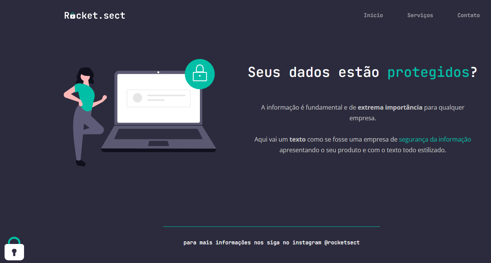

# Segurança dos Dados - Website

## Descrição do Projeto

Este projeto faz parte do Desafio Avançado do Nível 2 do Curso Explorer da Rocketseat. Nele, recriei um layout de uma página que fala sobre segurança dos dados, utilizando apenas HTML e CSS. A página foi desenvolvida com o objetivo de apresentar informações importantes sobre segurança de dados de forma clara e atraente.

## Tecnologias Utilizadas
- HTML
- CSS

## Demonstração

[Link para a página](https://susileal.github.io/rocketsect/)

## Como executar o projeto

1. Clone este repositório em sua máquina: `git clone https://github.com/susileal/rocketsect.git`
2. Acesse a pasta do projeto: `cd rocketsect`
3. Abra o arquivo index.html em qualquer navegador moderno.
